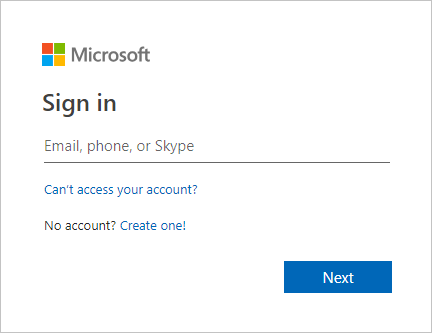
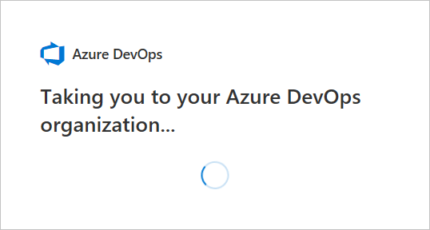
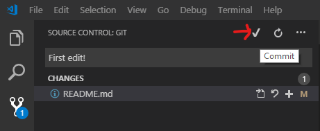
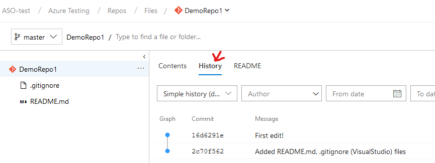

Table of contents
=================

<!--ts-->
   * [Working with Git](#Working-with-Git)
      * [Create an organization](#Create-an-organization)
      * [Create a repo using the web portal](#Create-a-repo-using-the-web-portal)
      * [Clone the repo to your computer](#Clone-the-repo-to-your-computer)
      * [Work with the code](#Work-with-the-code)
   * [Working with ARM Templates](#Working-with-ARM-Templates)
      * [Deploy Storage Account](#Deploy-Storage-Account)
      * [Deploy VM](#Deploy-VM)
<!--te-->

# Working with Git

## Create an organization

1.  Go to [Azure
    DevOps](https://go.microsoft.com/fwlink/?LinkId=307137), and use
    either a Microsoft or Azure AD account to sign in. Choose **Next**.

If you were previously signed up for Azure DevOps, select **New
organization**.

2.  Enter the name of your organization and select the location to host
    your projects from the dropdown menu. Choose **Continue**.

Congratulations, you're now an organization owner\! You are prompted to
[create a
project](https://docs.microsoft.com/en-us/azure/devops/organizations/projects/create-project?view=vsts)
to get started. 

## Create a repo using the web portal

Navigate to the **Repos** page in your project by browsing to
https://dev.azure.com/\<your account name, hovering your mouse over the
name of your project, and selecting the **Repos** icon. You can select
it from the **All** projects list, or from the **Recent** projects list
if you have accessed it recently.

From the repo drop-down, select **New repository**.

In the **Create a new repository** dialog, verify that Git is the repo
type and enter a name for your new repo. You can also choose to add a
README and create a .gitignore for the type of code you plan to manage
in the repo. A
[README](https://docs.microsoft.com/en-us/azure/devops/repos/git/create-a-readme?view=vsts)
contains information about the code in your repo, and a
[.gitignore](https://docs.microsoft.com/en-us/azure/devops/repos/git/ignore-files?view=vsts)
file tells Git which types of files to ignore, such as temporary build
files from your development environment.

When you're happy with the repo name and choices, select **Create**.

## Clone the repo to your computer

From your web browser, open the team project for your organization in
Azure DevOps and select **Repos** \> **Files**.

Select **Clone** in the upper-right corner of the **Files** window and
copy the clone URL.

Open Visual Studio Code and press F1 to start the command palette,
type Git: Clone press enter, paste the URL into the repository URL and
press enter, and select the folder were you want to store the cloned
repo.

When completed click on Open repository in lower right corner.

## Work with the code

In VS Code you should now have the repo opened and see the README.md
file, open README.md and make some changes, for example add “This is my
first edit”. to the file and save the changes.

When the file is saved a change will appear in the Source Control tab in
VS Code, you can then click on the changed file in the Source Control
tab and see the changed lines.

To commit the change to write a message to describe the change and click
Commit. The change is then committed to the local repo, to push it to
the remote branch press F1 to start the command palette, type Git Push
and press enter. The commit is now pushed to the remote repo.

To confirm that the commit is pushed to the remote repo in Azure DevOps
browse to
https://dev.azure.com/<OrganizationName>/<ProjectName>/_git/<RepoName>
and select the History tab to see the commit history.

# Working with ARM Templates

Go to <https://github.com/AndreasSobczyk/ARMandGITIntro> and download the
repository as a ZIP file and extract it. Copy the content from the
folder “ARM Templates” to your own repository locally, it should look
like this:

## Deploy Storage Account

Open the file 2\_StorageAccount.json in VSCode and set the storageSku
variable value to *Standard\_LRS*, this will set the storage account SKU
to Local Redudant Storage.

To deploy the storage account template open Deploy-Demo.ps1 in VSCode.

1.  Run *Login-AzureRmAccount* to login to your Azure Account. Notice
    that the login window might appear in the background.

2.  Run *Get-AzureRmContext* to validate that you are targeting the
    right subscription.

3.  If your need to change subscription run, *Get-AzureRmSubscription |
    Out-GridView -PassThru | Select-AzureRmSubscription* and select the
    right subscription.

4.  Run *New-AzureRmResourceGroup* to create a resource group for the
    storage account. Set the desired name and location.

5.  To deploy the ARM template run *New-AzureRmResourceGroupDeployment*
    and specify the StorageAccountPrefix, ResourceGroupName and
    TemplateFile properties as needed.

6.  Login to <https://portal.azure.com> and browse to Resource Groups
    and select your newly create Resource Group, and validate that you
    have create a new Local Redundant Storage account with desired
    prefix.
    
    

7.  If time, try to change the storageSku variable to Standard\_GRS and
    deploy the template again using
    *New-AzureRmResourceGroupDeployment.* You should now see that the
    storage account has changed to Geo-redundant storage.

## Deploy VM

Open the file *.\\simple-Windows-VM\\azuredeploy.json* in VSCode and
remove all DS-series sizes as allowed values for the parameter *vmSize,*
and adjust the variable nicName to concatenate the value from parameter
*vmName* with *‘-nic’* so the network interface resource name will be
*‘vmname-nic’*.  
Open the file *.\\simple-Windows-VM\\azuredeploy.parameters.json* and
set the desired *vmName*, the *windowsOSVersion* to 2016-Datacenter and
the *vmSize* to an allowed value.

1.  Run *New-AzureRmResourceGroup* to create a resource group for the VM
    template deployment. Set the desired name and location.

2.  To deploy the ARM template use *New-AzureRmResourceGroupDeployment*
    and specify the ResourceGroupName, TemplateFile and
    TemplateParameterFile properties as needed. When running the cmdlet
    you will be prompted for entering the desired password for the VM.

3.  Login to <https://portal.azure.com> and browse to Resource Groups
    and select your simple vm Resource Group, and validate that you
    deployed the resources showed below, with the correct naming, vm
    size and OS.
    
    

4.  If time left, try to add a DNS name to the public IP with
    inspiration from line 76-78 in the following template
    <https://github.com/Azure/azure-quickstart-templates/blob/master/101-vm-simple-windows/azuredeploy.json>
