## Git firste use

## Cloning a Git Repo with VSCode

From your web browser, open the team project for your organization in Azure DevOps and select **Repos** \> **Files**.

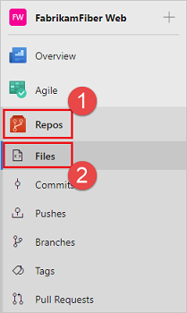

Select **Clone** in the upper-right corner of the **Files** window and copy the clone URL.

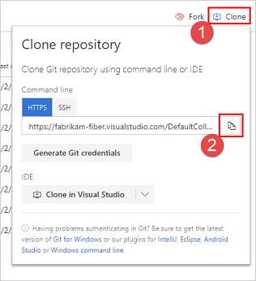

Open Visual Studio Code and press F1 to start the command palette, type *"Git: Clone"* press enter, paste the URL into the repository URL and press enter, and select the folder were you want to store the cloned repo.

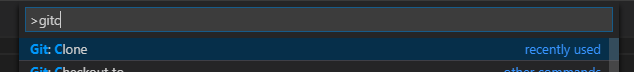

When completed click on Open repository in lower right corner.

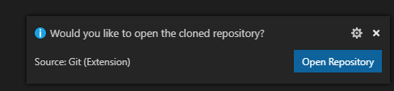

## Work with the code

In VS Code you should now have the repo opened and see the files inside the repo.

**Optional - Create branch to work in**
Press F1 to start the command palette, type *"Create Branch from"* press enter, enter the name of the branch you want to create press enter, and then select the source you want to create the branch from usually *"origin/master"* and press enter.
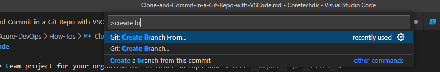 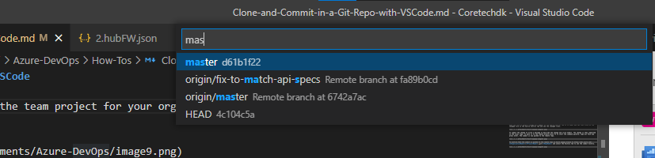

Your new working branch is now created.
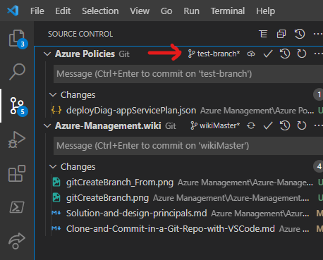

**Commit changes**
Open the files you need to change and make some changes and save the changes.

When the file is saved a change will appear in the Source Control tab in VS Code, you can then click on the changed file in the Source Control tab and see the changed lines.

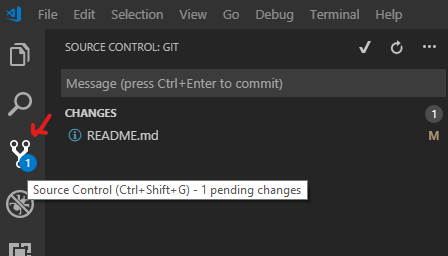

To commit the change to write a message to describe the change and click Commit. The change is then committed to the local repo, to push it to the remote branch press F1 to start the command palette, type Git Push and press enter. The commit is now pushed to the remote repo.

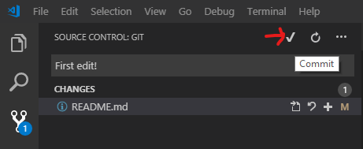

**If a branch was created**
If a branch was created you instead need to publish the branch for the first commit to the branch, then other commits to the branch is done as normal
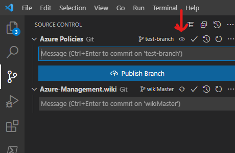

To confirm that the commit is pushed to the remote repo in Azure DevOps browse to https://dev.azure.com/**OrganizationName**/**ProjectName**/_git/**RepoName** and select the History tab to see the commit history.

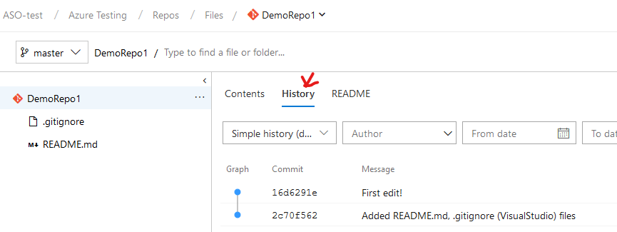

## Create and complete pull request
When your work in a branch is completed and you want to merge it into master or other branch you need to create a Pull Request.
To do this, go to the pull request menu under the branch in Azure DevOps, in the top bar you will see a message about the latest branch you worked in, click 'Create a pull request' to create a PR for that branch or use the 'New Pull Request' button to create for a different branch. Fill out the pull request form with a title, description and maybe work items.
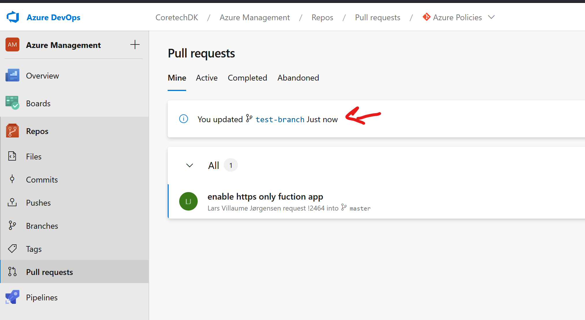

Set the pull request to auto-complete when the review is done or, complete the PR manually after review.
